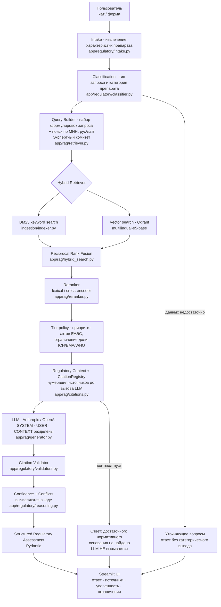
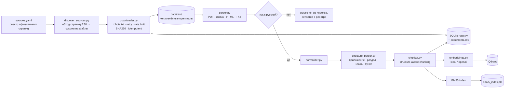

# Архитектура

## 1. Общая схема

## 2. Конвейер загрузки данных

## 3. Слои и ответственность

| Слой | Модули | Ответственность |
|---|---|---|
| Конфигурация | `app/config.py` | Настройки из `.env`, пути, логирование с маскированием секретов |
| Данные | `app/db/models.py`, `app/db/repository.py` | Модели документа и чанка, SQLite-реестр, статистика |
| Загрузка | `ingestion/*` | Обнаружение источников, скачивание, парсинг, чанкинг, индексация |
| Поиск | `app/rag/hybrid_search.py`, `retriever.py`, `reranker.py` | BM25 + вектор, RRF, реранкинг, политика уровней источников |
| Цитирование | `app/rag/citations.py` | Формирование и валидация ссылок, блок контекста для LLM |
| Генерация | `app/rag/prompts.py`, `generator.py` | System prompt, изоляция каналов, провайдеры LLM |
| Регуляторная логика | `app/regulatory/*` | Intake, классификация, схемы, валидация, уверенность, конфликты |
| Оркестрация | `app/rag/pipeline.py` | Единая точка входа, гарантии обоснованности |
| Интерфейс | `app/ui/*`, `app/main.py` | Streamlit: чат, форма оценки, база знаний |

## 4. Ключевые архитектурные решения

### 4.1 Цитаты создаются до вызова модели

`CitationRegistry` нумерует найденные фрагменты **до** обращения к LLM. Модель
получает только целые числа и может ссылаться исключительно на них. Она
физически не формирует объект цитаты — ни название документа, ни номер пункта,
ни URL. Всё, что не разрешается в реестре, удаляется на этапе валидации.

### 4.2 Пустой поиск не доходит до LLM

Если гибридный поиск не вернул фрагментов, конвейер возвращает фиксированный
ответ «Достаточное нормативное основание в доступной базе знаний не найдено» и
**не вызывает модель вообще**. Это исключает наиболее опасный сценарий —
правдоподобный ответ по памяти модели.

### 4.3 Понижение статуса утверждений

`validators.py` понижает `normative_requirement` до
`regulatory_interpretation`, если утверждение не имеет ссылки либо опирается
только на TIER-4 (ICH/EMA/WHO). Решения (`Decision`) без ссылок не могут иметь
статус «требуется»/«не требуется» — они переводятся в
`no_legal_basis_found`.

### 4.4 Уверенность вычисляется, а не запрашивается

`reasoning.compute_confidence` складывает наблюдаемые признаки: наличие и число
обязательных источников, доля утверждений со ссылками, сила поиска, статус
редакции, наличие МНН-специфичной рекомендации; вычитает штрафы за конфликты,
утратившие силу документы, отсутствие обязательных актов и недостаточность
входных данных. Каждый вклад показывается пользователю.

### 4.5 Версии не консолидируются

Система хранит исходный акт и акты о внесении изменений как отдельные
документы, связывая их полями `amends_document` / `amended_by`. Она **никогда**
не собирает «действующую редакцию» пересказом изменений средствами LLM. Если
редакцию нельзя установить автоматически, `version_status =
requires_expert_validation`, и это отражается в ограничениях ответа.

### 4.6 Изоляция prompt injection

Три канала разделены явными заголовками: `SYSTEM INSTRUCTIONS`, `USER INPUT`,
`RETRIEVED REGULATORY CONTEXT`. Каждый фрагмент обёрнут в маркеры
`<<<ФРАГМЕНТ N НАЧАЛО>>> … <<<ФРАГМЕНТ N КОНЕЦ>>>`, а system prompt прямо
указывает, что содержимое блока — данные и не может менять поведение системы.
Тест `test_injected_text_stays_inside_context_delimiters` проверяет, что
инъекция остаётся внутри границ блока данных.

## 5. Потоки данных в цифрах

| Этап | Артефакт |
|---|---|
| Реестр источников | `data/registry/sources.yaml` |
| Кандидаты на загрузку | `data/registry/discovered.json` |
| Реестр документов | `data/registry/documents.csv` + таблица `documents` |
| Оригиналы файлов | `data/raw/<authority>/<slug>__<sha10>.<ext>` |
| Чанки | таблица `chunks` + `data/processed/chunks.jsonl` |
| Словарь МНН | `data/processed/inn_vocabulary.json` |
| BM25 | `database/bm25_index.pkl` |
| Векторы | `database/qdrant/` (local) или сервер Qdrant |
| Статистика | `data/processed/corpus_statistics.json` |
| Оценка качества | `data/processed/evaluation_results.json` |
